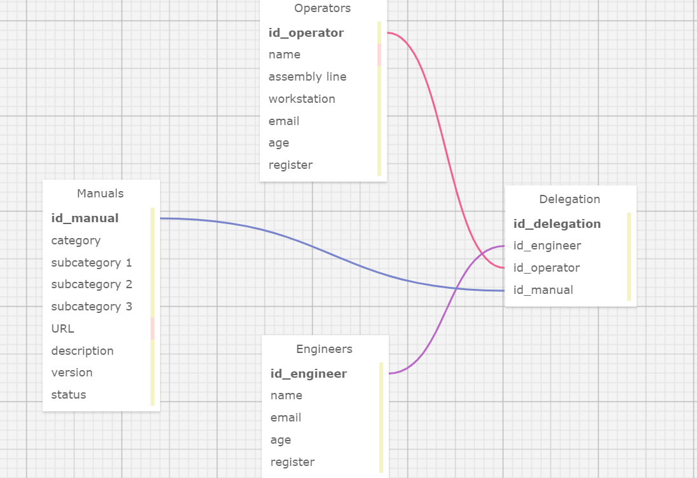

# Ponderada de programação - modelagem de banco de dados (semana 3)

A modelagem de dados é o processo essencial de visualizar e definir como uma organização estrutura e gerencia suas informações. Esta visualização cria uma representação clara e unificada dos dados, identificando o que é coletado, como os diferentes conjuntos de dados se conectam e os métodos usados para análise e armazenamento. Dentro deste processo, o modelo relacional de dados surge como uma ferramenta crucial, oferecendo uma representação simplificada do propósito, escopo e design do projeto de dados. Com ele, é possível compreender de forma abrangente os dados contidos no sistema, seus atributos, as regras de negócio relacionadas e os requisitos de segurança e integridade.

A visualização da estrutura de dados é realizada por meio do Modelo Entidade-Relacionamento (MER), composto por entidades, atributos e relacionamentos. No esquema relacional apresentado, destacam-se entidades como "Manuais", "Operadores", "Engenheiros" e "Delegação". Cada entidade é caracterizada por atributos que descrevem suas propriedades específicas. Além disso, as entidades podem se interligar por meio de relacionamentos, refletindo dependências ou interações entre elas. Cada entidade se reaciona com outra seguindo uma cardinalidade, por exemplo: manuais se relacionam com delegações com uma cardinalidade (1,1) <-> (1,1), engenheiros se relacionam com as delegações com uma cardinalidade (1,1) <-> (1,1) e, por fim, operadores se relacionam com as delegações com uma cardinalidade (1,1) <-> (1,n).

